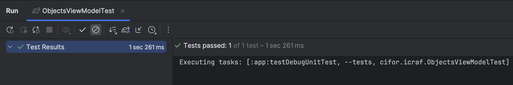
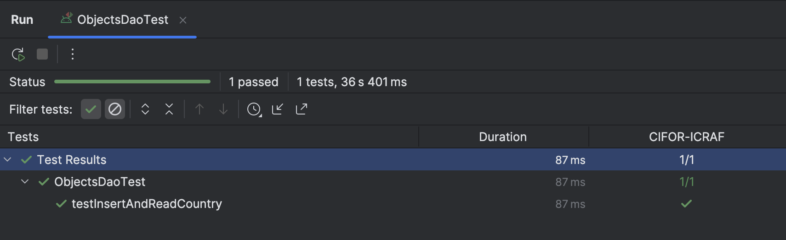
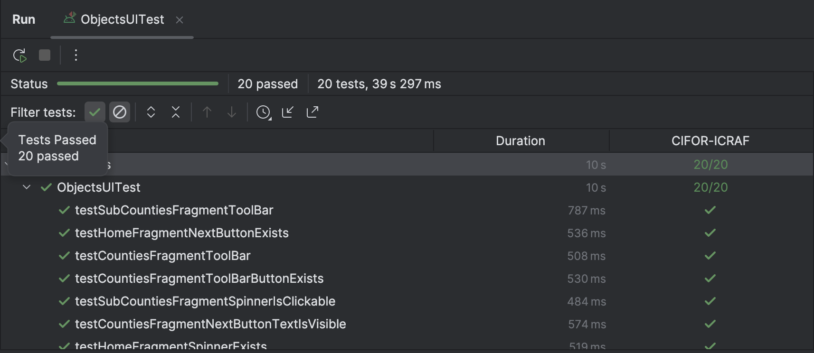
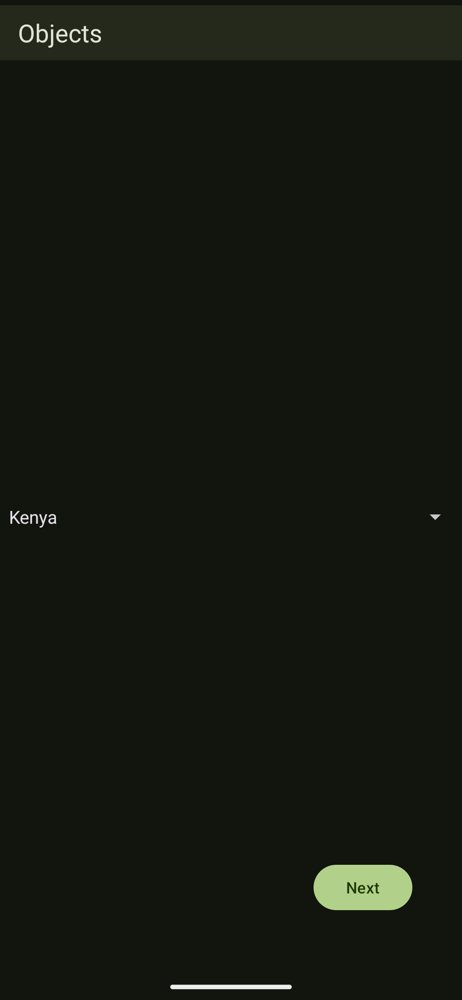
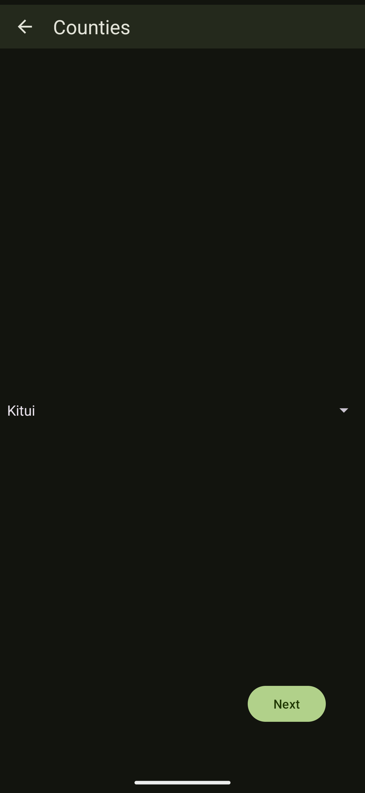
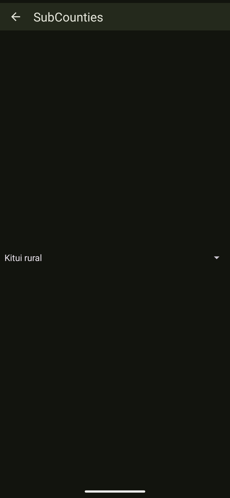

## Overview

Objects is an Android application that was built to test the feasibility of a JSON file that is to be added in the next iteration of the Regreening app to map Countries with their Counties and SubCounties. It was built for internal testing purposes and thus has no commercial use...

## Table of Contents

1. [Background](#background)
2. [Requirements](#requirements)
3. [Project Structure](#project-structure)
4. [Procedure](#procedure)
5. [Tests](#tests)
6. [Screenshots](#screenshots)
7. [Credits](#credits)

## Background

Objects was developed over time to test if the proposed JSON file was correctly formatted and could be called from a REST API among other remote sources...

## Requirements

- These are the requirements for setting up the project:

### 1. Laptop
- The project requires a laptop with the minimum/recommended specifications set by Google for running Android Studio...

### 2. Android Studio
- This is the IDE used to run the project...
- Depending on the time of installation, the IDE may prompt you to update the project's Android Gradle Plugin (AGP) version...

### 3. Emulator/Physical Device (Android/iOS)
- To run the app, an Emulator provided by Android Studio or a physical device (USB/Wireless Debugging) is required...

## Project Structure

- Objects has one module (:app) that is divided into the following packages:

### i) commons

- This package contains the Screen States of the app based on the Network Result...

### ii) feature

- This package mocks the conventional :feature module in a modularised project and is divided into: ui (It contains the UI Elements such as Fragments and the ViewModel), data (It abstracts the UI Layer from the Data Sources), and source (It contains both the Local and Remote Data Sources...)...

### iii) main

- This package contains the Application Class (Dependency Injection) and MainActivity (Entry Point of The App)...

## Procedure

- To set up the project, please follow this procedure:

1. ### The Cloning
- To clone the project from GitHub, open Android Studio and choose "Clone from Version Control"...
- When presented with the Dialog, copy anRd paste the following URL in the box requesting for the repository's URL: https://github.com/emmanuelmuturia/Snapbite

### 2. The Setup
- Once the project is open in Android Studio, upgrade it to the latest AGP version if prompted and follow the steps presented using the AGP Assistant...

### 3. The Launch
- If you do not have an Emulator and would like to use it for running the app, then simply go to "Device Manager" on the right-hand panel of Android Studio and click the "+" icon to add a new Virtual Device. Choose your preferred device and configurations, including the System Image if you have none installed...
- If you would like to use a Physical Device insRtead, here are the two options you should use to connect it to Android Studio:

#### 1. USB Debugging
- Ensure that your device has "USB Debugging" enabled by first enabling Developer Options (Check your device's website for the steps you need to take for this) and navigating to the "Developer Options" section and toggling "USB Debugging" on...
- Connect your device to the laptop using a USB cable and select "Transfer Files"...
- That's it!

### 2. Wireless Debugging (Android 11+)
- To use Wireless Debugging instead, follow the above procedure but enable "Wireless Debugging" instead of "USB Debugging"...
- Once that is done, navigate to "Device Manager" and click the WiFi icon...
- You will be presented with a QR Code. On the "Developer Options" under "Wireless Debugging", choose "Pair using QR Code" and scan the QR code that has been presented to you in Android Studio. Alternatively, select the "Pair using Pairing Code" and do the same on your device still under "Wireless Debugging". Wait for Android Studio to scan and discover your device...
- That's it!

## Tests

| Test                                                              | Description                   |
|-------------------------------------------------------------------|-------------------------------|
|  | This is the ViewModel Test... |
|              | This is the DAO Test...       |
|              | These are the UI Tests...     |

## Screenshots

|                           Screenshot #1                           |                           Screenshot #2                           |                           Screenshot #3                           |
|:-----------------------------------------------------------------:|:-----------------------------------------------------------------:|:-----------------------------------------------------------------:|
|  |  |  |

### Demo

[The Demo](assets/demo/demo.webm)

## Credits

- This project has been developed and supported by the following Tools, Technologies, and Libraries:

### 1. Kotlin

- [Kotlin](https://kotlinlang.org) was used due to its number of benefits including its ease of use...

### 2. Kotlin Serialisation Plugin

- [Kotlin Serialisation Plugin](https://github.com/Kotlin/kotlinx.serialization) was used to serialise and deserialise the data when mocking the REST API calls...

### 3. Koin

- [Koin](https://insert-koin.io) was used for Dependency Injection due to its simplicity and seamless integration with Kotlin...

### 4. Room

- [Room](https://developer.android.com/jetpack/androidx/releases/room) was used to store and handle data locally on the Android device using SQLite...

### 5. KSP

- [Kotlin Symbol Processor (KSP)](https://kotlinlang.org/docs/ksp-overview.html) was used to handle the annotations used for example in the Room Entities with Performance as the priority...

### 6. Leak Canary

- [LeakCanary](https://square.github.io/leakcanary/) was used to detect and report Memory Leaks in the Android application...

### 7. Retrofit and OkHttp

- [Retrofit](https://square.github.io/retrofit/) and [OkHTTP](https://square.github.io/okhttp/) were used to make and mock the REST API calls respectively...

### 8. Safe Args

- [Safe Args](https://developer.android.com/guide/navigation/use-graph/safe-args) was used to generate Classes which allowed for type-safe navigation in the Views context (pun intended)...

### 9. JUnit, MockK, Kotlin Coroutines Test, and Espresso

- [JUnit](https://junit.org/junit4/) was used to run the Tests...
- [MockK](https://mockk.io) was used to mock the dependencies used for Testing...
- [Kotlin Coroutines Test](https://kotlinlang.org/api/kotlinx.coroutines/kotlinx-coroutines-test/) was used to test the dependencies and asynchronous functionalities that relied on Kotlin Coroutines...
- [Espresso](https://developer.android.com/training/testing/espresso) was used to conduct the UI Tests...
